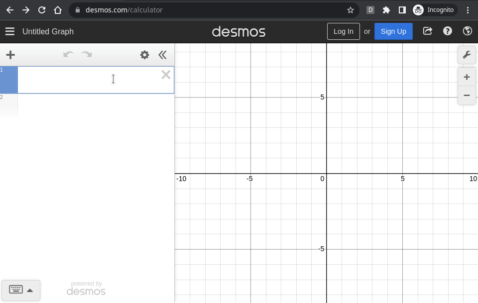

# DesmosTextIO

Chrome extension: Import/Export graphs as a text (json) in Desmos

<iframe width="560" height="315" src="https://www.youtube.com/embed/RnQ7_H4XFGY" title="YouTube video player" frameborder="0" allow="accelerometer; autoplay; clipboard-write; encrypted-media; gyroscope; picture-in-picture" allowfullscreen></iframe>
